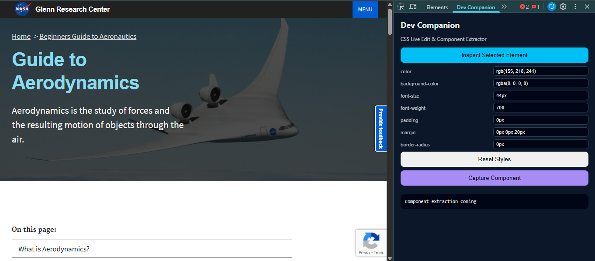
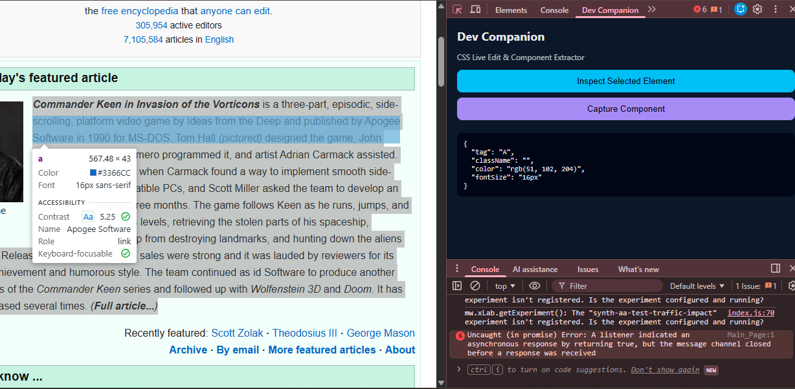

# Changelog

All notable changes to this project will be documented in this file.

The format is inspired by *Keep a Changelog* and follows basic semantic versioning.

---

## [1.2.0] – Hardened Live CSS Editing
### Added
- Scoped live CSS editing
- Unique selector targeting
- Reset styles support

<!-- Screenshots for this version -->

### Will fix the three big weaknesses of the current version:

- Fragile selectors (class-based → affects multiple elements)
- Styles overwrite each other
- No reset / cleanup mechanism

### Final Output

- Each selected element gets its own unique selector
- Multiple CSS properties can be edited together
- Styles are scoped to only that element
- One-click Reset styles button
- Clean injected <style> management

## [1.1.0] – Live CSS Editing
### Added
- Editable computed CSS properties
- Live style injection into inspected page

<!-- Screenshots for this version -->

## Expected limitations for this version
- Styles reset on refresh
- Only limited CSS props
- Class selector may affect similar elements (acceptable for now)

## [1.0.0] – Initial Scaffold

### Added
- Manifest V3 DevTools extension setup
- DevTools panel creation
- Element inspection using `chrome.devtools` APIs
- Dark, developer-focused UI

### UI
Initial DevTools panel with basic inspection output.

<!-- Screenshots for this version -->

### Planned
- Live CSS editing
- Component extraction to React
- ZIP export
