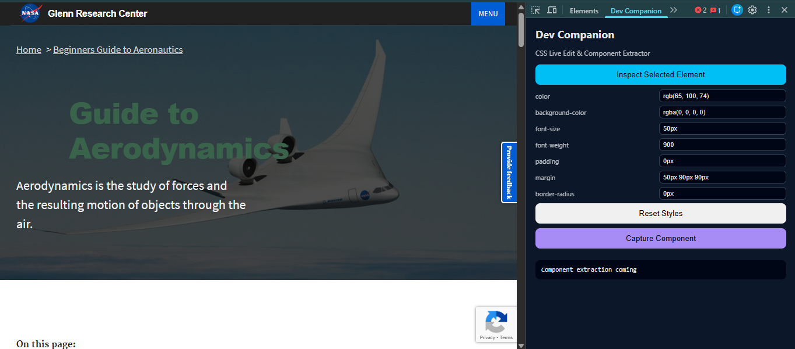

# Dev Companion – CSS Live Edit & Component Extractor

An advanced Chrome DevTools extension for frontend developers.

## Status
Initial scaffold with working DevTools panel.

---

## Screenshots

## How to Use

Dev Companion is a **Chrome DevTools extension**, not a popup-based extension.  
It runs inside Chrome DevTools and interacts with the currently inspected page.

Follow the steps below to use it correctly.

---

### 1️⃣ Load the Extension

1. Open Chrome and go to `chrome://extensions`
2. Enable **Developer mode** (top-right)
3. Click **Load unpacked**
4. Select the project folder (`dev-companion-css-live-edit`)

---

### 2️⃣ Open a Webpage

Open any webpage where you want to inspect or extract components, for example:
- Wikipedia
- A blog page
- Your own website or app

---

### 3️⃣ Open Chrome DevTools

Use any of the following:
- `F12`
- `Ctrl + Shift + I`
- Right-click → **Inspect**

---

### 4️⃣ Open the Dev Companion Panel

Inside DevTools:
1. Look at the top tab bar (`Elements`, `Console`, `Network`, etc.)
2. Scroll right if needed
3. Click on **Dev Companion**

This opens the extension’s custom DevTools panel.

---

### 5️⃣ Select an Element (Important)

Dev Companion works with the **currently selected DOM element**.

1. Go to the **Elements** tab
2. Click the **element picker** (cursor icon in the top-left)
3. Click any element on the page  
   (e.g., a paragraph, div, heading, button)

The selected element becomes available to the extension.

---

### 6️⃣ Inspect the Selected Element

1. Switch back to the **Dev Companion** tab
2. Click **Inspect Selected Element**

You will see information such as:
- HTML tag name
- Class name
- Sample computed CSS properties

---

### 7️⃣ Capture Component (Planned Feature)

The **Capture Component** button will:
- Extract the selected DOM subtree
- Convert it into JSX-safe markup
- Extract styles into a CSS file
- Export everything as a downloadable React component

> ⚠️ This feature is currently under development and will be enabled in future updates.

---

## Notes

- Selecting text on the page does **not** select a DOM element
- Always use the **DevTools element picker**
- The extension does not show a clickable toolbar popup — this is expected behavior for DevTools extensions

## Roadmap
- Live CSS editing
- DOM subtree extraction
- React component + CSS module export

## Disclaimer
This project is under active development.
